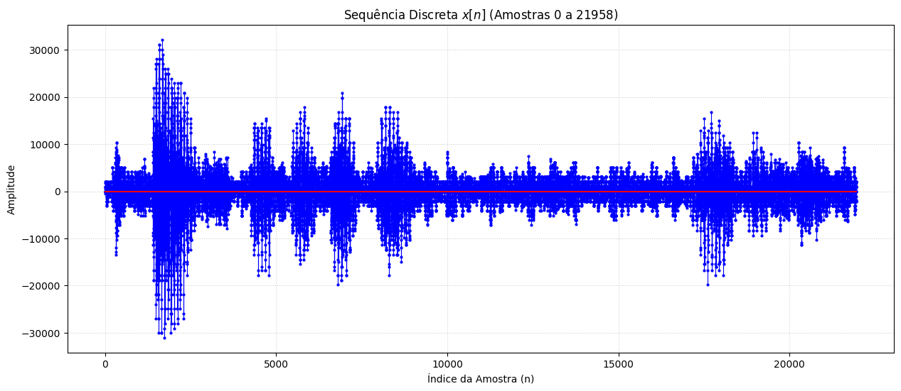
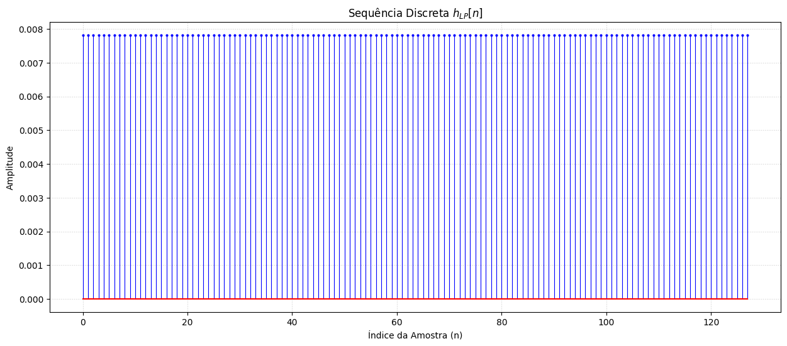
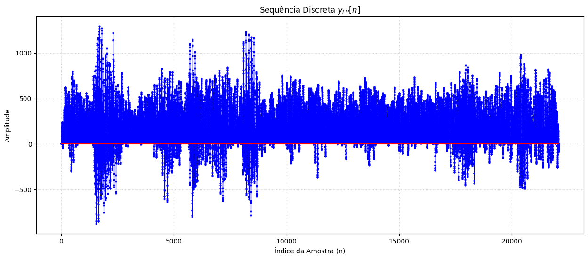
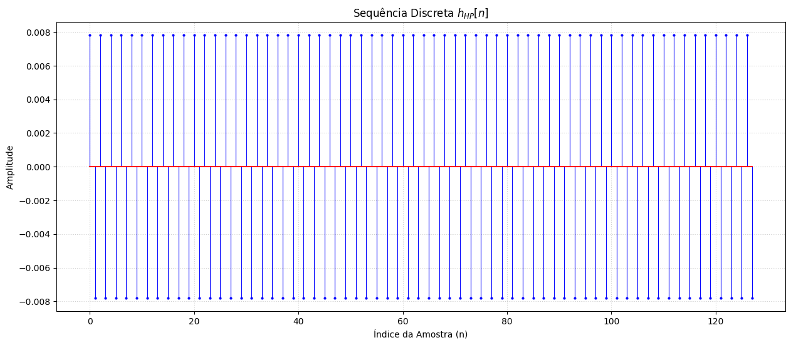
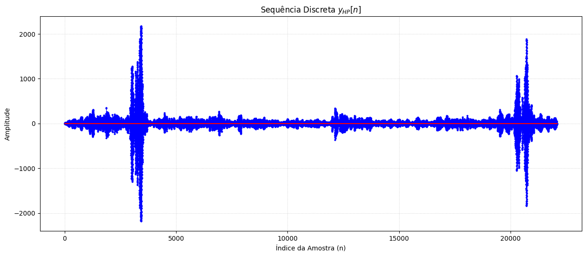

# Trabalho Computacional 1: Processamento Digital de Sinais

**Aluno:** Daniel Moreira Paes Leme

**Disciplina:** CEL100 - Processamento Digital de Sinais (UFJF)

## Questão 1: Caracterização do Sinal de Áudio

A primeira etapa consistiu na extração dos parâmetros de digitalização do arquivo de áudio `forcewithyou.wav`.

| Parâmetro | Valor |
| --- | --- |
| **Resolução de Quantização** | 16 bits |
| **Número Total de Amostras ($N$)** | 21.958 |
| **Taxa de Amostragem ($f_s$)** | 8.012 Hz |
| **Período de Amostragem ($T_s$)** | 124,81 $\mu$s |

---

## Questão 2: Filtragem por Média Móvel ($M=128$)

### (a) Resposta ao Impulso Passa-Baixas ($h_{LP}[n]$)

O filtro de média móvel é definido pela sua equação de diferenças. Ao excitar o sistema com um impulso unitário $\delta[n]$, obtemos a resposta ao impulso:

$$h_{LP}[n] = \frac{1}{M} \sum_{l=0}^{M-1} \delta[n-l]$$

Para $M=128$, a resposta resulta em uma sequência retangular de amplitude constante $1/128$:

$$h_{LP}[n] = 
\begin{cases} 
\frac{1}{128}, & 0 \leq n \leq 127 \\ 0, & \text{caso contrário} 
\end{cases}$$

### (b) Convolução Linear e Comprimento de Saída

A saída $y[n]$ foi obtida através da convolução linear entre o sinal de entrada $x[n]$ e a resposta ao impulso $h[n]$:

$$y[n] = x[n] * h[n] = \sum_{l=-\infty}^{\infty} x[l] \cdot h[n-l]$$

O comprimento da sequência resultante confirma a teoria de sistemas LIT, onde $L_y = L_x + L_h - 1$:

* $N_{y[n]} = 21958 + 128 - 1 = \mathbf{22085}$ amostras.

### (c) Análise Auditiva (Passa-Baixas)

A escuta do sinal filtrado $y_{LP}[n]$ revelou uma perda significativa de componentes de alta frequência. O áudio apresenta um timbre **abafado**, característico da atenuação dos agudos. Adicionalmente, notou-se uma leve redução na percepção de volume.

---

### (d) Filtro Passa-Altas ($h_{HP}[n]$)

#### Caracterização Matemática

O filtro passa-altas foi derivado do filtro original através da modulação da resposta ao impulso: $h_{HP}[n] = (-1)^n \cdot h_{LP}[n]$.

$$h_{HP}[n] = 
\begin{cases} 
\frac{(-1)^n}{128}, & 0 \leq n \leq 127 \\ 0, & \text{caso contrário} 
\end{cases}$$

Esta operação desloca a resposta em frequência do filtro, convertendo o comportamento de média móvel em um detector de variações abruptas.

#### Resultado da Convolução

O comprimento da saída permanece idêntico ao caso anterior ($N=22085$), porém a forma de onda reflete apenas as altas frequências do sinal original.

#### Análise Auditiva (Passa-Altas)

Diferente do filtro anterior, o resultado é um áudio mais agudo. As frequências fundamentais da voz (graves) foram eliminadas. A amplitude percebida é consideravelmente menor devido à menor concentração de energia nas altas frequências do sinal de fala original.
